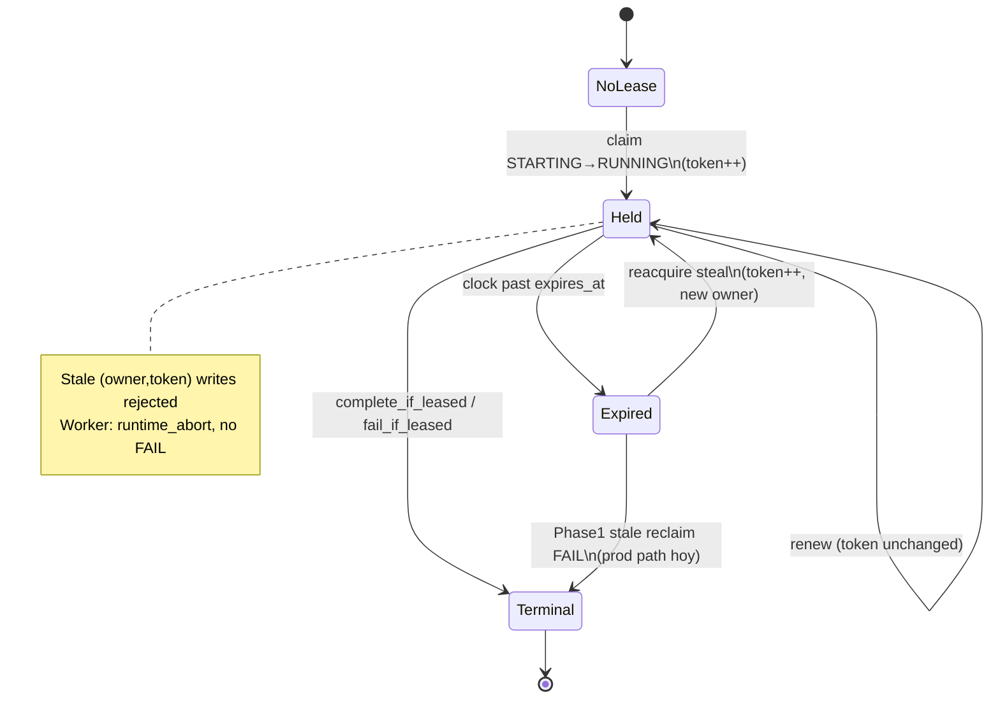

# Phase 3 — Fencing state machine

Estados del **lease** sobre un job `inventory_jobs` (complementa la state machine de status Phase 1).

## Lexicon

- **Owner** = `claim_owner_id`
- **Token** = `lease_fencing_token` (monotónico)
- **Expiry** = `lease_expires_at`
- Worker activo sostiene un `JobLease` en memoria con `(owner, token, expires_at)`

## Estados lógicos del lease

```text
[NO_LEASE]
   token = 0 (o residual), expires_at NULL / irrelevante
   job status típico: STARTING, QUEUED, terminal

[HELD]
   owner = W, token = N (>= 1), expires_at > now
   job status: RUNNING | CANCEL_REQUESTED

[EXPIRED]
   owner = W, token = N, expires_at < now
   job status aún RUNNING (hasta steal o stale-fail)

[STOLEN]
   owner = W2 ≠ W, token = N+1 (o mayor), expires_at fresh
   el holder previo (W, N) queda stale

[TERMINAL]
   job SUCCEEDED | FAILED | CANCELED
   renew/write → JOB_TERMINAL / reject
```

## Transiciones (con tokens)

| Desde | Evento | Condición CAS | Hacia | Token |
|---|---|---|---|---|
| NO_LEASE / STARTING | `try_claim_starting_to_running` win | `status='starting'` | HELD | `N → N+1` (típicamente 0→1) |
| HELD | `renew_lease` / heartbeat | owner+token+not expired | HELD | **igual** `N`; expiry extendido |
| HELD | time passes | `now > expires_at` | EXPIRED | igual `N` |
| EXPIRED | `reacquire_expired_lease` win | `running` ∧ `expires_at < now` | HELD (nuevo owner) | `N → N+1` |
| EXPIRED | reacquire lose (otro thread) | CAS miss | EXPIRED o STOLEN | sin cambio para el loser |
| HELD (stale W,N) | renew / merge / complete / fail | owner/token mismatch o expired | *reject* | sin cambio en DB |
| HELD | `complete_if_leased` / success path | lease válido | TERMINAL (SUCCEEDED) | token retenido en row |
| HELD | `fail_if_leased` | lease válido | TERMINAL (FAILED) | — |
| * | lease loss en worker | renew miss / `JobLeaseLostError` | worker **ABORT** (job no FAIL) | DB unchanged by abort |

## Diagrama



## Invariantes

1. Como máximo un `(owner, token)` válido puede renovar/escribir en un instante dado.
2. Token solo sube en **acquire** (claim) y **reacquire** (steal); never on renew.
3. Worker con token viejo no puede aplicar merge/complete/fail/renew.
4. Lease loss ⇒ halt cooperativo; **no** `FAILED` automático por fencing.
5. Steal de producción vía `reacquire_expired_lease` está en repo/tests; recovery productiva sigue pudiendo usar stale-fail Phase 1.

## Relación con job status (Phase 1)

Lease fencing **no** reemplaza `JobClaimOutcome` ni stale reclaim Option C. Amplía writes post-claim con fencing. Cancel unfenced y promotion/artifacts siguen fuera de esta máquina (ver `implementation-report.md` §11/13/15).
