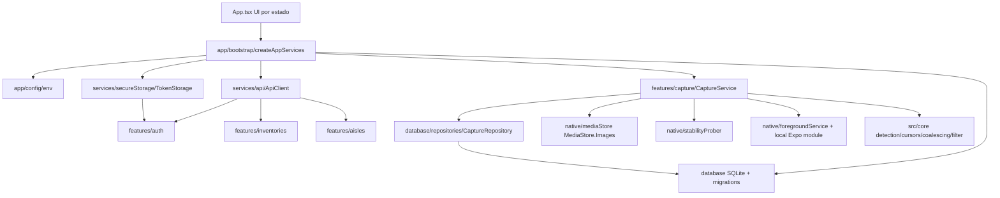

# Fase 1 unificada — implementación

## Estado

**Parcialmente validada.** La app compila, instala y valida localmente; falta ejecutar y firmar la prueba física completa con 20 fotografías, video ignorado y pantalla bloqueada.

## Arquitectura

La lógica pura sigue separada de React/Expo/SQLite/HTTP en `src/core`. Las pantallas consumen servicios y no implementan reglas de MediaStore, cursores ni estabilidad.

## Contratos API usados

- `POST /auth/login`
  - Request: `{ username, password }`
  - Response: `access_token`, `refresh_token`, expiraciones y `user`.
- `GET /auth/me`
  - Response: usuario autenticado.
- `POST /auth/refresh`
  - Request: `{ refresh_token }`
  - Response: nuevo par de tokens.
- `POST /auth/logout`
  - Request: `{ refresh_token }`, protegido por Bearer.
- `GET /api/v3/inventories/`
  - Query: `search`, `page`, `page_size`, `sort_by`, `sort_dir`.
  - Response paginada: `items`, `page`, `page_size`, `total_items`, `total_pages`.
- `GET /api/v3/inventories/{inventory_id}/aisles`
  - Query: `search`, `page`, `page_size`, `sort_by`, `sort_dir`.
  - Response paginada con `is_active`, `assets_count`, `latest_job`.

No se agregaron endpoints ni payloads nuevos.

## Persistencia local

SQLite crea:

- `capture_sessions`
- `capture_photos`
- `schema_migrations`

Restricciones:

- `UNIQUE(capture_session_id, asset_id)`
- índices por sesión, estado, asset y `date_added`
- cursores separados: `scan_cursor_*` y `last_valid_cursor_*`
- no se guardan bytes de imágenes

## Flujo de captura

1. Login y selección de inventario/pasillo contra backend existente.
2. Permiso solo fotografías.
3. Marcador inicial desde la última foto visible.
4. Sesión SQLite `active`.
5. FGS real y listener de galería.
6. Scan incremental newest-first hasta `scanCursor`.
7. Persistencia como `detected` y luego `waiting_stability`.
8. Prober de estabilidad + decode.
9. Estado final local: `stable`, `unstable`, `undecodable`, `rejected` o `excluded`.
10. Finalización mueve a `review`; confirmación mueve a `completed`.

## Validaciones ejecutadas

- `npm ci`: pasa; npm reporta 30 vulnerabilidades transitivas existentes.
- `npm run verify`: pasa.
- `npx expo-doctor`: 16/17; falla solo Xcode local incompatible con SDK 51.
- `npx expo prebuild -p android --clean`: pasa.
- `./gradlew assembleDebug`: pasa.
- `./gradlew installDebug`: pasa en `SM-G985F`, Android 13.

## Pendiente para aprobación total

- Prueba física completa con 20 fotografías.
- Agregar un video y confirmar que no entra en UI ni contadores.
- Bloquear pantalla/minimizar durante captura.
- Cerrar/reabrir y documentar recuperación.
- Capturas de pantalla de login, listados, captura y revisión.

